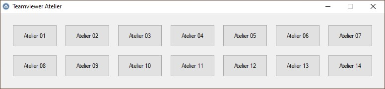

# TeamViewer

Petit script [AutoIt](https://www.autoitscript.com/site/) permettant de basculer rapidement entre deux sessions TeamViewer à l'aide d'une petite interface graphique. Nous utilisons ce script pour nos sessions de formation au numérique, afin de pouvoir projeter rapidement l'écran de chaque participant au groupe.

## Installation

*Ne fonctionne que sous Windows !*

1. Installer [AutoIt](https://www.autoitscript.com/site/autoit/downloads/)
2. Installer [TeamViewer](https://www.teamviewer.com/fr/telecharger/windows/)
3. Modifier le fichier `teamviewer.bat` afin de renseigner le bon chemin vers l'exécutable de TeamViewer
4. Lancer TeamViewer sur chaque poste cible
5. Modifier le fichier `teamviewer.tsv` en ajoutant une ligne par session Teamviewer cible, en renseignant le nom et l'identifiant TeamViewer (qui ne change jamais)

## Utilisation

1. Lancer TeamViewer sur chaque poste cible
2. Noter les mots de passe de chaque poste dans `teamviewer.tsv` (ces mots de passe changent à chaque démarrage de TeamViewer, c'est pourquoi il faut les modifier à chaque fois)
3. Exécuter le script `teamviewer.au3`
